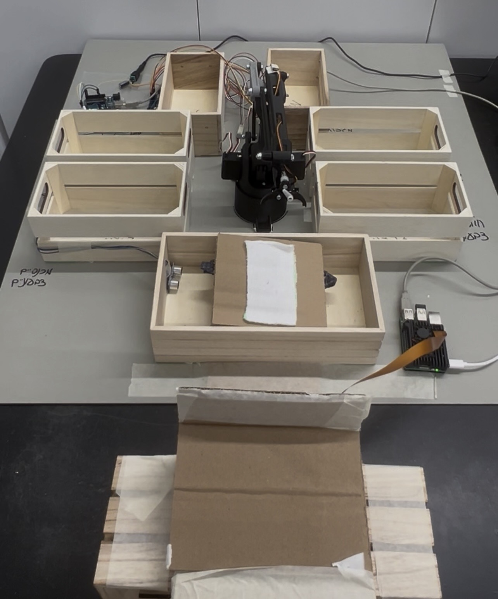
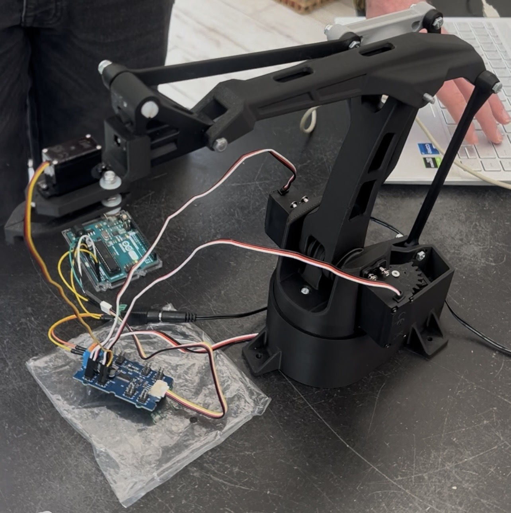
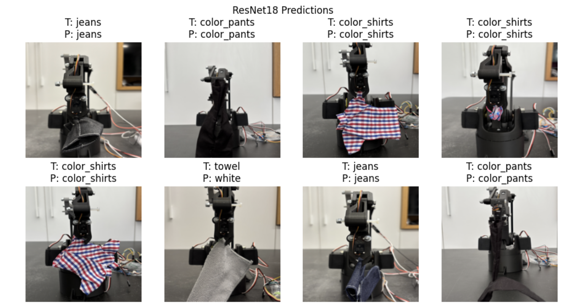
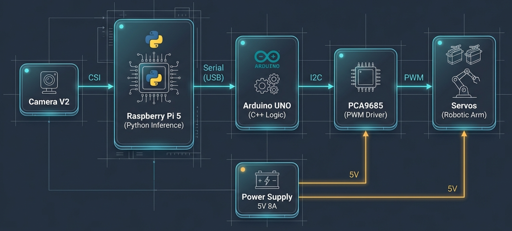
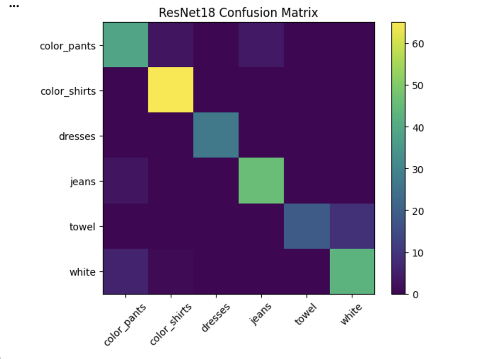
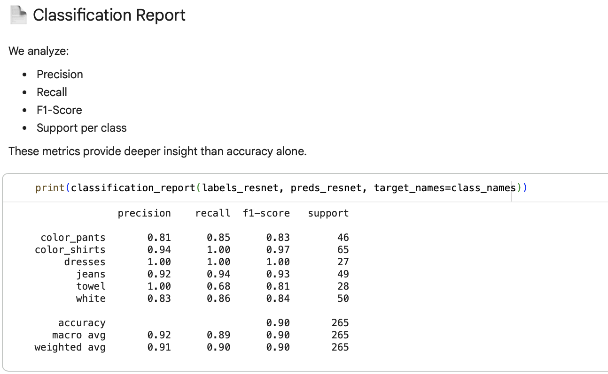

# 🤖 Autonomous Laundry Sorter


An end-to-end autonomous robotic system that classifies and sorts laundry items into labeled baskets — completely hands-free.

Built from scratch: 3D-printed robotic arm, custom-wired electronics, self-collected image dataset, and a fine-tuned deep learning model deployed on edge hardware.

---

## Demo

> The arm detects a clothing item via ultrasonic sensor → picks it up → holds it in front of the camera → classifies it using a ResNet18 model running on Raspberry Pi → drops it into the correct basket → waits for the next item.

### The System



*The complete setup: robotic arm surrounded by 6 sorting baskets*



*3D-printed robotic arm with servo motors and custom wiring*

### Dataset Sample



*Sample images from the custom dataset — photographed and labeled manually*

---

## System Architecture



```
Camera (CSI)
     │
     ▼
Raspberry Pi 5          ← Python inference (ResNet18 + PyTorch)
     │  Serial (USB)
     ▼
Arduino UNO             ← C++ motion logic
     │  I2C
     ▼
PCA9685 PWM Driver
     │  PWM
     ▼
Servo Motors → Robotic Arm
```

**Hardware stack:** Raspberry Pi 5 · Arduino UNO · PCA9685 PWM driver · Servo motors · Ultrasonic sensor · Camera Module V2 · 5V/8A power supply

**Software stack:** Python · PyTorch · torchvision · C++ (Arduino) · Serial protocol (PICK / HOLD / DROP / ACK / DONE)

---

## ML Model

### Approach: Transfer Learning with ResNet18

Rather than training from scratch, I fine-tuned a pretrained ResNet18 (ImageNet weights) on a custom clothing dataset.

**Training pipeline:**
- **Stage 1** — Freeze all layers, train only the classification head (FC layer) for 15 epochs
- **Stage 2** — Unfreeze `layer4` + FC, fine-tune with a lower learning rate (1e-4) for 8 additional epochs
- **Best model** saved based on validation accuracy

**Data augmentation:** random horizontal flip, rotation (±10°), color jitter

**Classes (6):**
| Label | Description |
|-------|-------------|
| `color_pants` | Colored trousers |
| `color_shirts` | Colored shirts |
| `dresses` | Dresses |
| `jeans` | Denim jeans |
| `towel` | Towels |
| `white` | White laundry |

**Results:**
- Test accuracy: ~90%
- Evaluated with confusion matrix and per-class classification report
- Custom CNN (trained from scratch) was also tested and compared — ResNet18 with transfer learning outperformed it significantly



*Confusion matrix on test set*



*Per-class precision, recall and F1 scores*

---

## Hardware Build

Everything was built by hand:

- **Robotic arm** — 3D-printed, assembled, and wired manually
- **Electronics** — Motors connected to PCA9685 PWM driver via I2C; power supply wired directly to driver and servos
- **Sensor** — Ultrasonic sensor detects when the input basket is full
- **Communication** — Raspberry Pi and Arduino communicate over Serial USB using a custom text protocol

### Hardware-Software Protocol

```
Pi → Arduino:   PICK          (pick up a garment)
Arduino → Pi:   HOLD          (arm is stable, camera can capture)
Pi → Arduino:   DROP <label>  (drop into correct basket)
Arduino → Pi:   ACK <label>   (command received)
Arduino → Pi:   DONE          (motion complete, ready for next item)
```

---

## Project Structure

```
laundry-sorter/
├── pi_main.py          # Raspberry Pi inference + serial control loop
├── train_custom.py     # ResNet18 fine-tuning pipeline (PyTorch)
├── check_data.py       # Dataset validation utility
├── arduino/
│   └── arduino.ino     # Arduino motion control (C++)
├── models/
│   └── resnet18_best_ft.pt   # Best fine-tuned model weights
├── train/              # Training images (by class folder)
├── val/                # Validation images
├── test/               # Test images
└── assets/
    └── system_photo.jpg
```

---

## Setup & Run

### Raspberry Pi

```bash
pip install torch torchvision pillow numpy pyserial picamera2

# Run the inference loop
python pi_main.py
```

### Training (on any machine)

```bash
pip install torch torchvision scikit-learn

# Organize dataset into train/val/test folders by class
python train_custom.py
```

### Arduino

Open `arduino/arduino.ino` in the Arduino IDE and upload to Arduino UNO.

---

## Key Challenges

| Challenge | Solution |
|-----------|----------|
| **Dataset collection** | Photographed and labeled a large custom dataset from scratch — hundreds of images per class, captured under varying lighting and angles to improve generalization |
| **Model selection** | Evaluated three architectures: custom CNN from scratch, YOLO, and ResNet18 with transfer learning. ResNet18 achieved the highest accuracy and was selected for deployment |
| **Custom CNN limitations** | Training from scratch required significantly more data and compute to reach acceptable accuracy — transfer learning proved far more effective for this dataset size |
| **Raspberry Pi thermal throttling** | Active cooling and optimized inference loop |
| **Motor power spikes** | Dedicated 5V/8A power supply for driver and servos |
| **Gripper angle precision** | Calibrated PWM values per basket position |

---

## Future Improvements

- Expand dataset for better generalization in varied lighting conditions
- Improve gripper mechanism for more reliable garment pickup
- Add active cooling solution for continuous operation
- Explore YOLO-based detection for multi-item scenarios

---

## Author

**Yuval Sucher** — CS Student, Holon Institute of Technology  
yuval1703456@gmail.com
